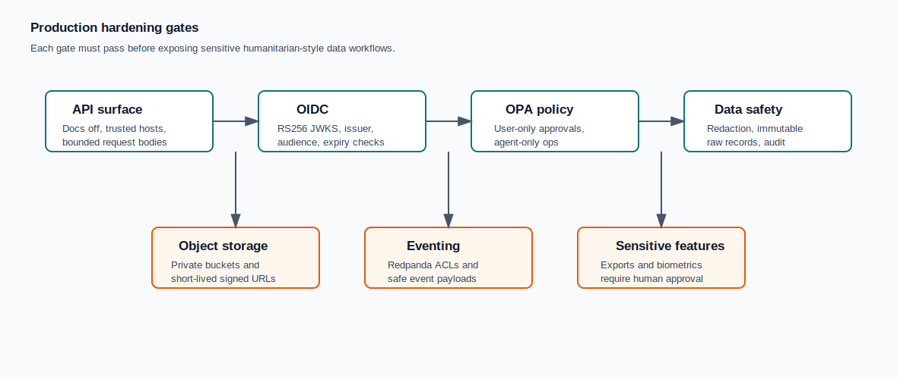

# Production Hardening Runbook

This runbook turns the remaining deployment risks into explicit release gates.
It is not a substitute for environment-specific security review.



## API Surface

Production API deployments must set:

- `VDCH_ENVIRONMENT=production`
- `VDCH_AUTH_MODE=oidc`
- `VDCH_DEV_AUTH_ENABLED=false`
- `VDCH_ALLOW_POLICY_BYPASS_FOR_LOCAL_DEV=false`
- `VDCH_OPA_ENABLED=true`
- `VDCH_TRUSTED_HOSTS=<public API hosts>`
- `VDCH_MAX_API_REQUEST_BYTES=<bounded JSON body size>`

OpenAPI docs are disabled by default in production. If docs are enabled with
`VDCH_API_DOCS_ENABLED=true`, route them through an authenticated internal path
or network allowlist.

Write request models reject unknown fields. Do not loosen this behavior for
operator, source, review, promotion, or OpenClaw runbook endpoints.

## OIDC And Keycloak

Before production traffic:

1. Create a confidential OpenClaw service-account client.
2. Assign only `openclaw_operator_agent` plus the specific runbook scopes needed.
3. Create separate clients for mobile apps, operators, and external systems.
4. Configure `VDCH_OIDC_ISSUER`, `VDCH_OIDC_AUDIENCE`, and `VDCH_OIDC_JWKS_URL`.
5. Verify a real RS256 token from Keycloak can call an allowed endpoint.
6. Verify spoofed `X-Actor-Type` and `X-Scopes` headers do not change privileges.
7. Verify expired, wrong-audience, and wrong-issuer tokens fail closed.

Do not use the local HS256 test verifier outside isolated tests.

## Source Adapters

Production manifests should use bounded HTTPS adapters:

- `http_json`
- `http_jsonl`
- `http_csv`

All sources must use public HTTPS hosts present in both the manifest
`allowed_hosts` and the server-side `VDCH_MANIFEST_HOST_ALLOWLIST`. Do not allow
source-provided authorization headers, cookies, proxy headers, private IPs,
loopback hosts, link-local hosts, or redirects.

## Object Storage

Object storage is required before enabling file uploads, raw payload snapshots,
large reports, or exports.

Minimum controls:

- S3-compatible bucket with server-side encryption enabled.
- Separate credentials for API, workers, and backup jobs.
- No public bucket access.
- Short-lived signed URLs only.
- Object keys generated by the server, never from original filenames.
- Lifecycle policies for raw uploads, derived reports, snapshots, and deletion.
- Audit event for every signed URL or export artifact creation.

## Redpanda Or Kafka

Event streaming should remain disabled until the following are configured:

- TLS or private-network transport.
- Per-service credentials and ACLs.
- Topics for ingestion requests, job events, quarantine events, and audit-safe
  operations summaries.
- Dead-letter topics and replay runbooks.
- Consumer lag alerts.

Events must carry resource IDs, counters, status, and trace IDs only. Do not
publish raw identifiers, HMAC tokens, raw payloads, manifest samples, or source
secrets.

## Exports

Exports are not raw-data downloads. Before enabling export execution:

- Require a human data-steward approval.
- Scope exports by source, job, purpose, and retention window.
- Produce derived safe fields only unless a separate high-risk approval exists.
- Store export artifacts in object storage with short-lived signed URLs.
- Log approval ID, requester, approver, artifact ID, row count, and trace ID.
- Keep OpenClaw limited to diagnostics and issue creation around exports.

## Biometrics

Biometric processing remains disabled unless all controls below exist:

- Explicit source or job-level opt-in approval.
- Separate policy operation for biometric enablement.
- Model version and embedding version tracking.
- Retention, deletion, and recompute workflow.
- Audit event for every enablement, processing run, and deletion.
- No OpenClaw mutation path for biometric controls.

AI or biometric signals must never be the final identity authority.

## Observability

OpenTelemetry, Prometheus, Grafana, and logs must use safe telemetry only:

- Request ID or trace ID.
- Operation name.
- Resource type and resource ID.
- Status, counters, durations, queue lag, and error codes.

Do not emit raw identifiers, HMAC tokens, raw payloads, manifest bodies, source
secrets, signed URLs, or free-form reviewer/operator text.

## Release Gate

Before production launch, run:

```bash
ruff check .
pytest -W error
docker compose -f infra/docker-compose.yml config
git diff --check
VDCH_DATABASE_URL='<fresh-postgres-url>' alembic upgrade head
```

Then run environment-specific checks for:

- OIDC live token acceptance and rejection cases.
- OPA allow and deny decisions.
- Object storage private access and signed URL expiry.
- Redpanda/Kafka ACL denial for unauthorized producers and consumers.
- Alert delivery for job failure, retry, quarantine backlog, and consumer lag.
